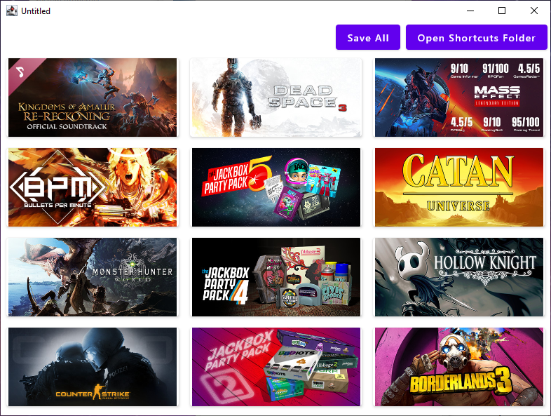

## Steam Start Launcher

The Steam Start launcher is a small tool that will scan your computer for isntalled steam games and create a shortcut
for each game in your Windows start menu!

Once done you can happily search for your games like you would any other program! No need to open Steam itself!

### How does it work?

1. Fetch a list of all steam games from http://api.steampowered.com/ISteamApps/GetAppList/v0002/
2. Scan for the local `VDF` file provided by each steam install. Default location is "C:\Program Files (x86)\Steam\steamapps\libraryfolders.vdf"
   1. This is done by using the library VDF (taken from this repo: https://github.com/StidOfficial/SteamVDF)
3. Create a fancy card for each installed game (Image Included)

Once all games are fetched the user can tap the "Save All" button to create a shortcut per file in the default Start Menu Folder
C:\ProgramData\Microsoft\Windows\Start Menu\Programs\Steam Games

The shortcuts themselves utilize the Steam Browser Protocol: https://developer.valvesoftware.com/wiki/Steam_browser_protocol

Note: All shortcuts are stored in a "Steam Games" subfolder for organization. "Save All" first deletes any files here and then generates new ones